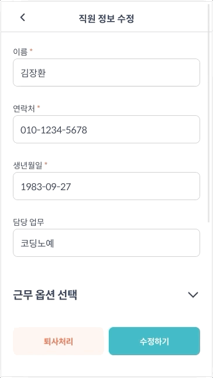
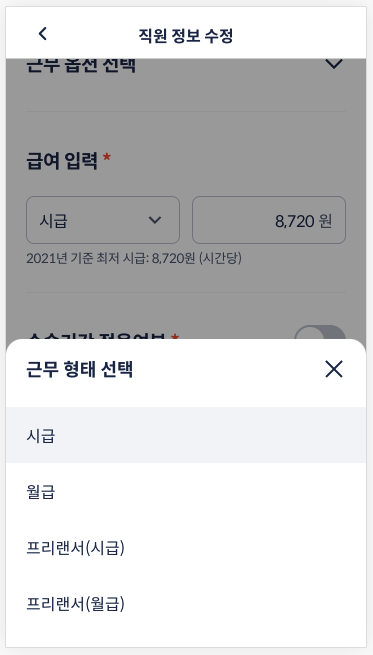
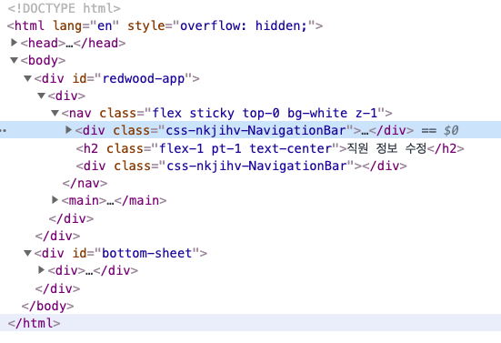
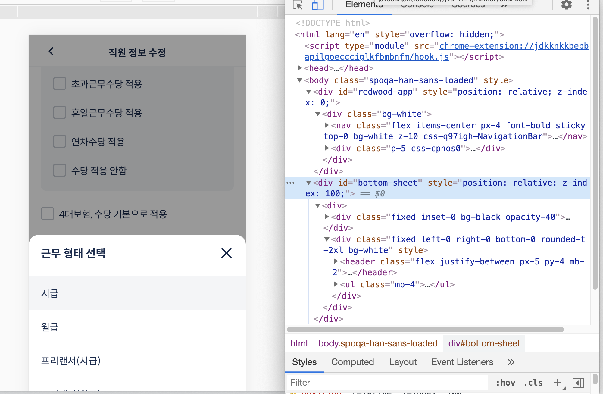
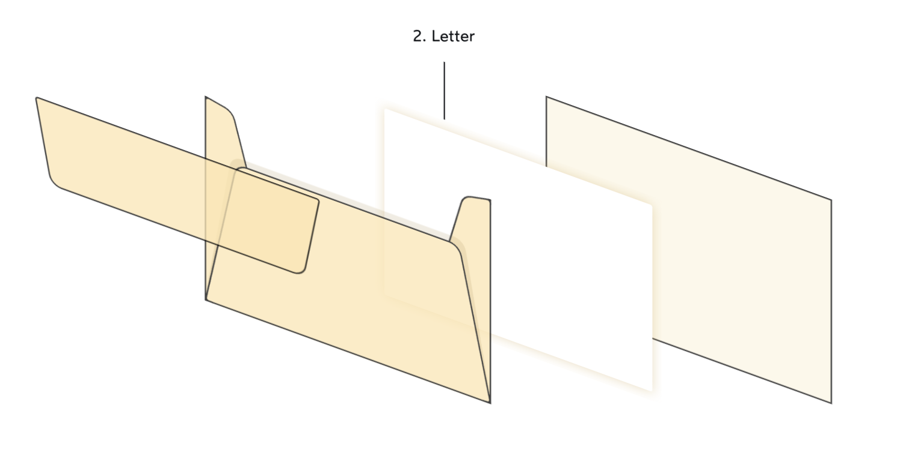

# 컴포넌트 시대의 z-index

2021-04-22 <br>
김장환


## 발단




## 발단




디자이너: 바텀시트라는건 전체를 다 덮어야 하는겁니다. 

(나도 안다...) 


## 당시 구성

* Main: 가장 밑에 깔린다
* Header: 본문 위에 있어야 한다 (`sticky` + `z-index`)
* Bottom Sheet: 특정 경우에 뜰 수 있다 (`z-index`?)


```
.
├── app
|   ├── nav
|   |   └── header
|   └── main
└── bottom sheet
```


## 당시 구성

* Main: 가장 밑에 깔린다
* Header: 본문 위에 있어야 한다 (`sticky` + `z-index`)
* Bottom Sheet: 특정 경우에 뜰 수 있다 (`z-index`?)


```
.
├── app
|   ├── nav
|   |   └── header
|   └── main
└── bottom sheet
```




## 당시 구성 (문제점)

* Main: 가장 밑에 깔린다
* Header: 본문 위에 있어야 한다 (`sticky` + `z-index`)
* Bottom Sheet: 특정 경우에 뜰 수 있다 (`z-index`?)


```
.
├── app
|   ├── nav (z-index)
|   |   └── header
|   └── main
└── bottom sheet (z-index)
```


## 인터넷에 찾아보면..

z-index 검색하면 따라나오는 "stacking context"...


* "z-index 는 동일 stacking context 안에서만 의미를 갖는다."

* "stacking context은 positioned element 에서만 가능하다."


* "아 근데 opacity 줘도 생기긴 함"

* "아 근데 transform 줘도 생기긴 함"

* "아 근데 display: flex 이면 자식 중에 z-index 줘도 생기긴 함"

* "...."


제일 많이 나오는 말: .underline[ “안 될 때는 `position: element;` 를 추가하세요.” ]


### stacking context 를 생성하는 것들

from [developer.mozilla.org/.../Understanding_z_index/The_stacking_context](https://developer.mozilla.org/en-US/docs/Web/CSS/CSS_Positioning/Understanding_z_index/The_stacking_context#the_stacking_context)

* `<html>`
* `position: absolute | relative` 이면서 `z-index`가 auto가 아닌 것
* `position: fixed | sticky`
* `flex` container 에 속해 있으면서 `z-index`가 auto가 아닌 것
* `grid` container 에 속해 있으면서 `z-index`가 auto가 아닌 것
* `opacity` 가 1 보다 작은 것
* `mix-blend-mode` 가 normal 이 아닌 것 (??)
* `transform`, `filter`, `perspective`, `clip-path`, `mask`, `mask-image`, `mask-border` 값이 none이 아닌 것
* `isolation: isolate;`
* `-webkit-overflow-scrolling: touch;`
* `will-change` 값이 stacking context 를 만드는 경우
* `contain: layout | paint`


## z-index 의 어려움

* z-index 가 아닌 스타일을 입히느라 stacking context 가 생길 수 있다.
  (모든 경우를 다 이해하고, 쓸 때마다 인지하고, 변경을 따라갈 수 있을까?)

* 내가 원하는 컴포넌트/엘리먼트에 z-index를 줄 수는 있다.
  하지만 stacking context 를 줄 곳은 그 컴포넌트 안에서 정할 수 없다.

* 다른 어느 곳에서 이보다 더 높은 z-index 를 줄 지 알 수 없다.
  `z-index: 99999;`


요컨대, 

* 주어진 범위 안에서 온전히 결정할 수가 없고,

* 다른 곳에서 어떤 값을 주어서 오버라이드할 지 알 수가 없어서 안전하지 않다.
  (레벨이 추가된 `important!` 같은 느낌)

더욱이, 지금 같은 컴포넌트 세상에서는 다른 컴포넌트가 어떻게 돼 있을지 모르니까 함부로 z-index 를 주기 힘들다.


### isolate 란 무엇인가

* ...
* `isolation: isolate;`
* ...


> When we apply this declaration to an element, it does precisely 1 thing: it creates a new stacking context. <br>
> -- https://www.joshwcomeau.com/css/stacking-contexts/#airtight-abstractions-with-isolation


**'오로지 stacking context 를 주는 것만을 위한 스타일 룰'**


- `z-index` 따로 안 줘도 된다
- `position: static;` 에서도 쓸 수 있음
- 다른 렌더링 side effect 가 없다.


※ Browser support? [IE 빼고는 다 됩니다](https://caniuse.com/?search=isolation).


## z-index 를 해결하는 방법들


1. `z-index`를 보기를 돌 같이 하라. 

2. 전체 시스템 차원에서 `z-index`를 **관리**한다.

3. **컴포넌트 단위** 안에서만 동작할 수 있도록 관리한다.

4. **시스템**에서 큰 영역들을 나누고, 그 안에서 벗어나지 않도록 관리한다.


1. `z-index`를 보기를 돌 같이 하라. 

  GOTO문을 쓰지 않듯이 z-index를 멀리하고, 뒤에 나타난 엘리먼트가 위로 가는 자연적인 방식(natural stacking order)을 따르게 한다.
  
  * 장점: 복잡한 z-index 계산에서 벗어날 수 있다.
  * 단점: 어느 한 라이브러리가 z-index 를 쓰기 시작하면 말짱 도루묵.
  언제나 렌더링 순서를 따를 수 있는 것은 아니다.
  (위에 나오는 Header는 더 나중에 렌더링되어야 할까?)


2. 전체 시스템 차원에서 z-index를 관리한다.

어느 것이 위에 올라가야 하는지가 디자인 결정의 영역이라면 관리하는 것이 맞다.

* 모든 디자인적인 결정을 한 후에 z-index를 입힌다. --> human error에 취약
* 동적으로 z-index 값을 관리한다 (`ZIndexManager.requestZIndex()?`) --> human understanding이 취약


3. 컴포넌트 단위 안에서만 동작할 수 있도록 관리한다.

isolate 를 하든, relative position을 하든, 대상 컴포넌트나 그 보조들이 z-index 가 튀어나가지 않도록 애쓴다.


4. 시스템에서 큰 영역들을 나누고, 그 안에서 벗어나지 않도록 관리한다.
보통의 웹사이트의 영역:


* 컨텐츠
  * header
  * main

* portal
  * bottom sheet
  * modal


### 결국 해결한 방법





4\. 시스템에서 큰 영역들을 나누고, 그 안에서 벗어나지 않도록 관리한다.


### 내가 느끼기에


1. `z-index`를 보기를 돌 같이 하라. 
2. 전체 시스템 차원에서 `z-index`를 관리한다.
3. 컴포넌트 단위 안에서만 동작할 수 있도록 관리한다.
4. 시스템에서 큰 영역들을 나누고, 그 안에서 벗어나지 않도록 관리한다.

purist 라면 z-index 없는 세상을 꿈꿔 볼 수 있고,
이미 시스템이 너무 복잡하거나 세상을 단순하게 살고 싶지 않으면 manager 를 두고 위임할 수 있겠다 (아이언맨 타입).

컴포넌트 단위로 툴을 개발하는 사람은 `isolation: isolate;` 를 적극적으로 쓰면 좋겠다.

그 밖에, 어느 정도 규격화된 웹앱을 만드는 사람은 영역을 구분하는 수준으로 관리하게 될 것 같다.


... 애초에, 전체 모습을 신경쓰지 않고 대범한(z-index) 행동을 하는 라이브러리가 제대로 문제를 해결할 수 있을까?


### 찾아본 것 중 읽을 때 도움이 된 문서들




- .inline-block.w-8[] https://www.joshwcomeau.com/css/stacking-contexts/ (20 min.)
- .inline-block.w-8[] https://coder-coder.com/z-index-isnt-working/ (20 min.)
- .inline-block.w-8[] https://ishadeed.com/article/understanding-z-index/ (10 min.)
 
참고 문헌(레퍼런스):
* .inline-block.w-8[] https://developer.mozilla.org/en-US/docs/Web/CSS/CSS_Positioning/Understanding_z_index/The_stacking_context#the_stacking_context

